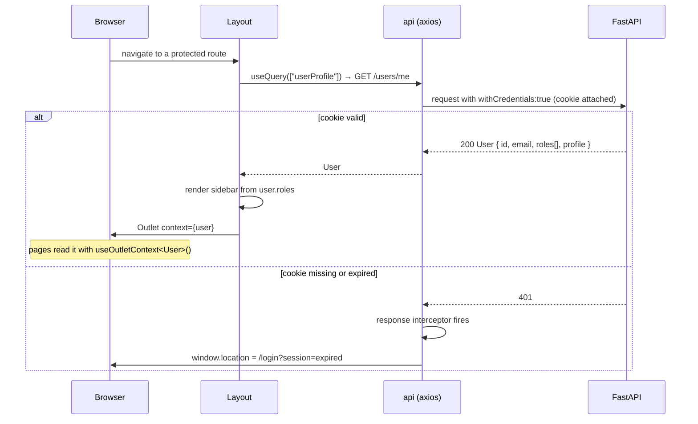
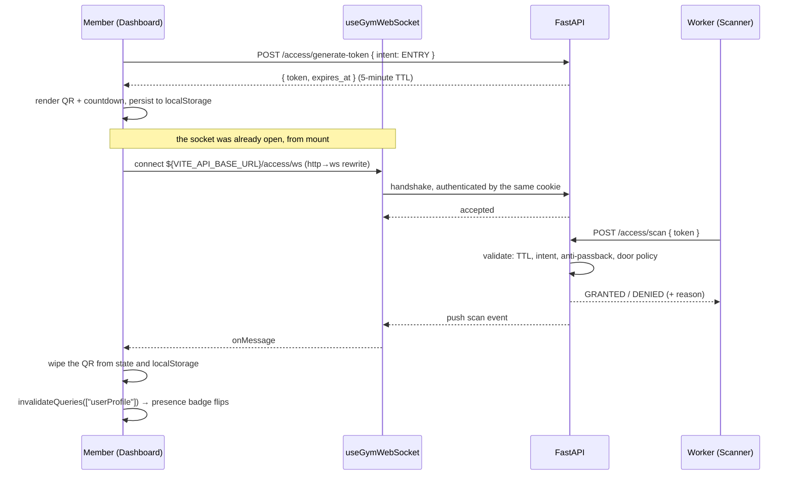
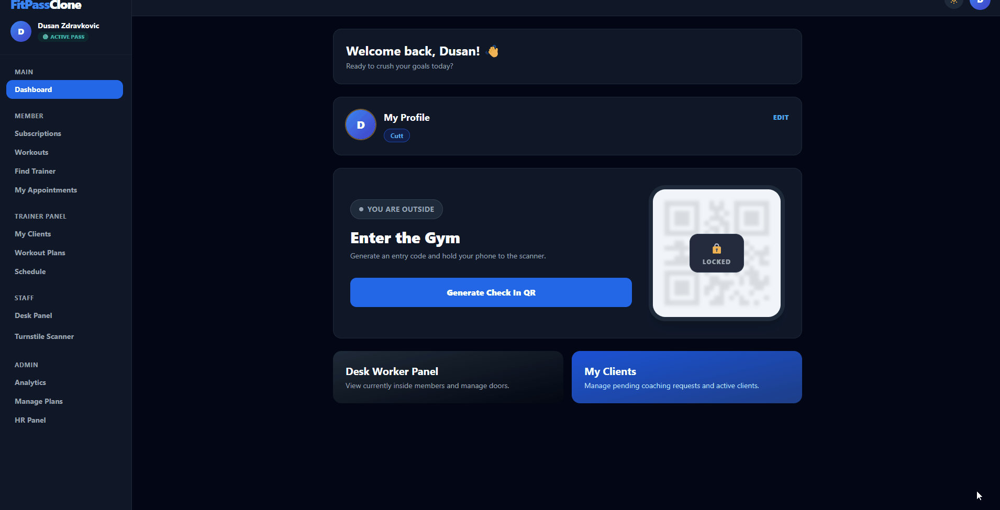

# Frontend Architecture

This document is the reference companion to the [README](./README.md). It covers the routing
and role model, the two flows that are genuinely non-obvious (authentication and the QR
turnstile), the React Query cache contract, and the conventions that hold the data layer
together.

## Table of Contents

- [Project Layout](#project-layout)
- [Route Map](#route-map)
- [Authentication Flow](#authentication-flow)
- [QR Turnstile and the Realtime Channel](#qr-turnstile-and-the-realtime-channel)
- [Data Layer](#data-layer)
- [Workout Data Model](#workout-data-model)
- [Styling and Theming](#styling-and-theming)

---

## Project Layout

```
src/
├── App.tsx                     Route table — the single source of truth for routing and roles
├── main.tsx                    Providers: StrictMode → QueryClient → BrowserRouter
│
├── api/
│   └── axios.ts                The shared `api` instance. withCredentials + 401 interceptor
│
├── components/
│   ├── Layout.tsx              Sidebar, auth gate, dark-mode toggle. Exports User/Role/UserProfile
│   ├── RequireRole.tsx         Route guard — renders <Forbidden> instead of a broken screen
│   ├── Avatar.tsx              Profile picture with initials fallback
│   ├── ProgressCard.tsx        Recharts strength-progress card
│   ├── LiveWorkoutModal.tsx    Set-by-set logging during a session
│   ├── RestTimer.tsx           Countdown with beep and vibration
│   ├── SessionDetailModal.tsx  Read-only view of a finished session
│   └── MyTrainerChip.tsx       Linked-trainer badge
│
├── hooks/
│   └── useGymWebSocket.ts      Self-healing WebSocket: backoff, jitter, online recovery
│
├── pages/
│   ├── Login, Register, VerifyEmail, ForgotPassword, ResetPassword
│   ├── Dashboard, Profile
│   ├── NotFound, Forbidden, ErrorPage
│   ├── member/                 Subscriptions, Workouts, MemberCoaching, MemberAppointments
│   ├── trainer/                TrainerPlans, TrainerClients, TrainerAppointments
│   ├── worker/                 WorkerDashboard, WorkerScanner
│   └── admin/                  AdminAnalytics, ManagePlans, HRPanel
│
└── utils/
    ├── auth.ts                 Session helpers
    ├── workout.ts              Shared types, roundToStep, parseTargetReps, playBeep, vibrate
    ├── subscription.ts         Subscription standing and perk checks
    ├── coaching.ts             Trainer-client relationship states
    └── profile.ts              Resolves avatar paths to /api/static/...
```

Tests live next to the code they cover as `*.test.ts(x)`, so `tsc -b` type-checks them and a
broken test fails `npm run build`.

---

## Route Map

Defined entirely in `src/App.tsx`. Public routes render bare; everything else renders inside
`<Layout>`, which supplies the sidebar and the authenticated `User` object.

### Public

| Path | Page | Notes |
|---|---|---|
| `/` | — | Redirects to `/login` |
| `/login` | `Login` | Reads `?session=expired` to explain a forced logout |
| `/register` | `Register` | Honeypot + reCAPTCHA + password strength ladder |
| `/verify-email` | `VerifyEmail` | Consumes the token from the verification email |
| `/forgot-password` | `ForgotPassword` | Requests a reset link |
| `/reset-password` | `ResetPassword` | Consumes the reset token |

### Authenticated, any role

| Path | Page |
|---|---|
| `/dashboard` | `Dashboard` — QR turnstile, subscription standing, presence badge |
| `/profile` | `Profile` — details, avatar upload, password change |

### Role-gated

Each block sits inside `<RequireRole allowed={[...]}>`, and each ends with a catch-all so a
typo inside a role section keeps the sidebar instead of ejecting the user to the global 404.

| `allowed` | Path | Page |
|---|---|---|
| `member` | `/subscriptions` | `Subscriptions` |
| `member` | `/workouts` | `Workouts` |
| `member` | `/coaching` | `MemberCoaching` |
| `member` | `/appointments` | `MemberAppointments` |
| `worker` | `/worker/dashboard` | `WorkerDashboard` |
| `worker` | `/worker/scanner` | `WorkerScanner` |
| `worker` | `/worker/*` | `NotFound` |
| `admin` | `/admin/plans` | `ManagePlans` |
| `admin` | `/admin/hr` | `HRPanel` |
| `admin` | `/admin/analytics` | `AdminAnalytics` |
| `admin` | `/admin/*` | `NotFound` |
| `trainer` | `/trainer/plans` | `TrainerPlans` |
| `trainer` | `/trainer/clients` | `TrainerClients` |
| `trainer` | `/trainer/appointments` | `TrainerAppointments` |
| `trainer` | `/trainer/*` | `NotFound` |

| `*` | `NotFound standalone` — deliberately **outside** `Layout`, so a logged-out visitor on a broken link actually sees the 404 instead of being bounced to `/login` by the layout's auth check. |
|---|---|

### Two rules to keep in sync

1. **Every role-gated route sits inside `<RequireRole>`.** Without the guard the user does not
   get a 403 — they get the page, which immediately fills with failed API calls. The guard is
   a UX affordance, not the security boundary; the real enforcement is server-side.
2. **The sidebar links in `Layout.tsx` must match the guarded routes exactly.** A user holds
   several roles at once, so the sidebar is assembled from role membership. A link that points
   at a path with a different guard produces a 403 the user cannot explain.

---

## Authentication Flow

The session is an HTTP-Only, `SameSite=Lax` JWT cookie issued by the API. JavaScript cannot
read it, which is the point: there is no token to exfiltrate through an injected script, and
consequently no auth context, no header plumbing and no refresh dance in this codebase.



Three consequences worth spelling out:

- **`src/api/axios.ts` is the only HTTP entry point.** Every request goes through the exported
  `api` instance. A raw `axios` or `fetch` call would omit `withCredentials`, so it would be
  unauthenticated, and it would also bypass the 401 interceptor — meaning an expired session
  would surface as a broken screen instead of a redirect.
- **The interceptor skips `/login` and `/register`.** Otherwise a failed login attempt (which
  legitimately answers 401) would trigger a redirect to the page the user is already on,
  wiping the error message they were supposed to read.
- **`Layout` owns the user object.** It fetches `/users/me` once, caches it under
  `["userProfile"]`, and passes the whole `User` down through `<Outlet context={user}>`. The
  `User`, `Role` and `UserProfile` interfaces are exported from `src/components/Layout.tsx` and
  mirror the backend's Pydantic schemas one to one.

`RequireRole` then reads that same context. If the required role is absent it renders
`<Forbidden requiredRoles={allowed} />` — which names the role the user would need, instead of
a generic access-denied wall.

---

## QR Turnstile and the Realtime Channel

This is the most involved flow in the application, and the one where the frontend does real
security work rather than just rendering what the API returns.



### Why the QR is wiped rather than left to expire

The token is single-use server-side regardless. Wiping it from the screen closes the *social*
attack: a member cannot photograph a still-valid code and pass the picture to a friend outside,
because the code vanishes the instant it is used. It also gives the member unambiguous feedback
that the scan worked, which matters at a turnstile where nothing else confirms it.

### Why the socket is a custom hook

`src/hooks/useGymWebSocket.ts` exists because a raw `new WebSocket()` inside a `useEffect` works
right up until the network blinks — and the network blinking is not an edge case here. A member
walking into the gym typically hands off from mobile data to the gym WiFi, which silently kills
the socket. The page keeps looking healthy while being completely deaf.

| Behaviour | Detail |
|---|---|
| **Exponential backoff** | 1s → 2s → 4s → 8s → capped at 10s, so recovery still feels immediate to a human |
| **Jitter** | Every delay is nudged by ±20%, so a thousand phones that dropped during the same restart do not all wake in the same millisecond and knock the server over again |
| **Instant recovery** | Listens for the browser `online` event and reconnects immediately, rather than sitting out the rest of a backoff window that is no longer necessary |
| **Refuses to retry `1008`** | The API closes with policy-violation when the auth cookie is missing or expired. That is not a network blip, and retrying it hammers the API on behalf of someone who is logged out |
| **`onMessage` lives in a ref** | Refreshed on every render, never in the effect's dependency array. A handler in the dependency array turns every reconnect into an endless rebuild loop — the single trap this hook is designed around |
| **Ordered cleanup** | The "we are closing on purpose" flag is raised *before* `close()`. Otherwise our own close fires `onclose`, which schedules a reconnect, which leaves an orphaned second socket after every StrictMode remount |

The hook returns `{ status, lastMessage, reconnectAttempt }`. `lastMessage` carries a
monotonic `seq` counter, so two identical payloads in a row — two manual overrides, say — are
still distinct objects and still fire the consumer's effect twice.

---

## Data Layer

TanStack React Query v5 owns all server state. There is no Redux and no global store, because
outside of form drafts and UI toggles almost nothing in this application is client state.

### Cache keys

Keys are namespaced under a shared prefix so one `invalidateQueries` can refresh a whole
screen.

| Key | Owner | Invalidated by |
|---|---|---|
| `["userProfile"]` | `Layout` (`GET /users/me`) | Anything touching roles, profile or subscription standing — `Dashboard`, `Profile`, `HRPanel`. Removed entirely on logout. |
| `["plans"]` | `Subscriptions` | Admin plan edits |
| `["mySubscription"]` | `Subscriptions`, `MemberCoaching`, `MemberAppointments` — exported as `MY_SUBSCRIPTION_KEY` from `src/utils/subscription.ts` so the three pages cannot drift apart | Checkout completion, cancellation |
| `["worker", "search", term]` | `WorkerDashboard` | — (search) |
| `["worker", "inside", page]` | `WorkerDashboard` | Manual override → `invalidateQueries(["worker"])` |
| `["worker", "logs", page]` | `WorkerDashboard` | Same |
| `["admin", "analytics", …]` | `AdminAnalytics` | `invalidateQueries(["admin"])` |
| `["admin", "audit", "overrides", page]` | `AdminAnalytics` | Same |
| `["admin", "users", "search", term]` | `AdminAnalytics` | Same |
| `["admin", "users", "logs", id, page]` | `AdminAnalytics` | Same |
| `["admin", "staff"]` | `HRPanel` | Hire/fire → also invalidates `["userProfile"]`, since an admin can change their own roles |

### Conventions

**No raw `useEffect` fetching in new code.** `useQuery` for reads, `useMutation` for writes.

**A cache-hostile GET is still a `useMutation`.** A door check must never be served from cache
— a stale "allowed" is a security defect, not a stale UI. `WorkerDashboard.tsx` uses a mutation
for exactly this reason, even though the request is a GET.

**Paged and search queries need `placeholderData: keepPreviousData`.** Without it the list
blanks on every page change and every keystroke.

**Render loading on `isPending`, never `isFetching`.** This is the one that trips people up:
with `keepPreviousData`, `isFetching` stays true through every background refetch, so a spinner
keyed to it hides the very data `keepPreviousData` just preserved. Adding `keepPreviousData`
without also fixing the condition fixes nothing.

The same rule applies to empty states. `total === 0` is also true before the first response
lands, so the "nothing here" message must be gated on `isPending` first — otherwise it flashes
on every mount.

**Do not read `query.dataUpdatedAt` for anything user-visible while `keepPreviousData` is in
play.** It describes the key currently being fetched and reads `0` while the previous page is
still on screen. Stamp the time inside the `queryFn` instead — see `InsidePage` in
`WorkerDashboard.tsx`. Reading a clock during render would also make the component impure and
trip `react-hooks/purity`.

### The API contract

List endpoints return `{ "total": int, "items": [...] }`, never a bare array. `total` is the
size of the whole filtered set rather than the current page, which is what lets the frontend
decide whether **Next** should be disabled. The matching TypeScript interfaces mirror the
backend's Pydantic schemas — when a response shape changes, the interface changes with it.

---

## Workout Data Model

`exercise_logs` stores **one row per set**, not one per exercise, with a 1-based `set_number`.
That single decision drives the whole feature:

- A **personal record** is the maximum `weight_kg` across the rows of one exercise within one
  session. That is what `ProgressCard` charts and what the history tab headlines.
- Partial sessions are meaningful. A member who logs three of five planned sets has three real
  rows, not a half-filled exercise record.
- Volume (sets × reps × weight) is a sum over rows, not a reconstruction from a summary.

Shared logic lives in `src/utils/workout.ts`:

| Export | Purpose |
|---|---|
| `groupLogsByExercise` | Folds the flat per-set rows back into per-exercise groups for display, which is where the personal record is derived |
| `roundToStep` | Snaps entered weight to the plate increment (`WEIGHT_STEP_OPTIONS`, default `2.5`), so the chart is not noise |
| `parseTargetReps` | Reads a trainer's `"8-12"` or `"AMRAP"` target into something comparable |
| `playBeep` | Rest-timer signal through the Web Audio API — no audio asset to load or cache |
| `vibrate` | Haptic fallback for a phone lying face-down on a bench |

---

## Styling and Theming

Tailwind CSS 3.4 with class-based dark mode: `Layout` toggles the `dark` class on `<html>` and
persists the choice to `localStorage.theme`. Every new surface needs both a light and a dark
class — there is no automatic inversion, and a missing dark variant shows up as white text on
white.

<div align="center">
  
</div>

The visual language is deliberately consistent:

| Element | Convention |
|---|---|
| Cards and panels | `rounded-2xl` |
| Headings | `font-black` |
| Primary accent | `blue-600` |
| Status badges | `emerald` for good standing / granted, `rose` for expired / denied |

There is no icon library in the bundle — icons are inline SVG in the components that use them.
