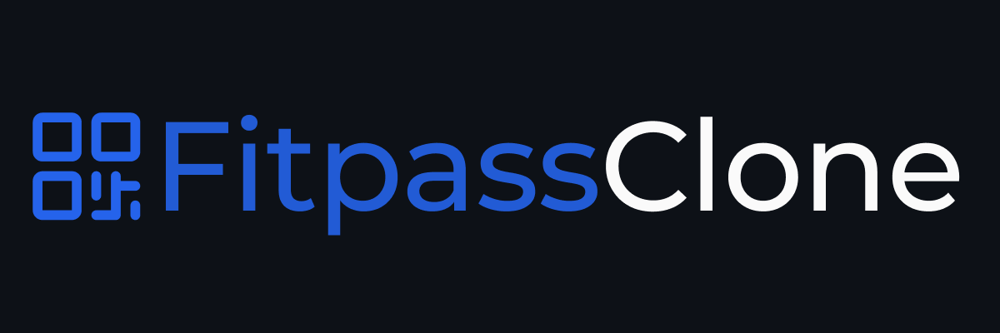
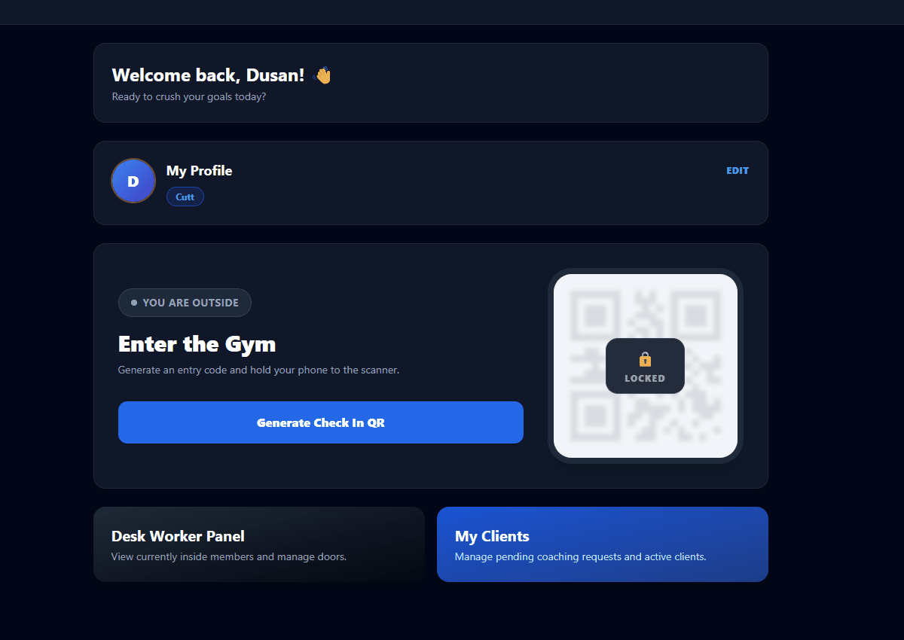
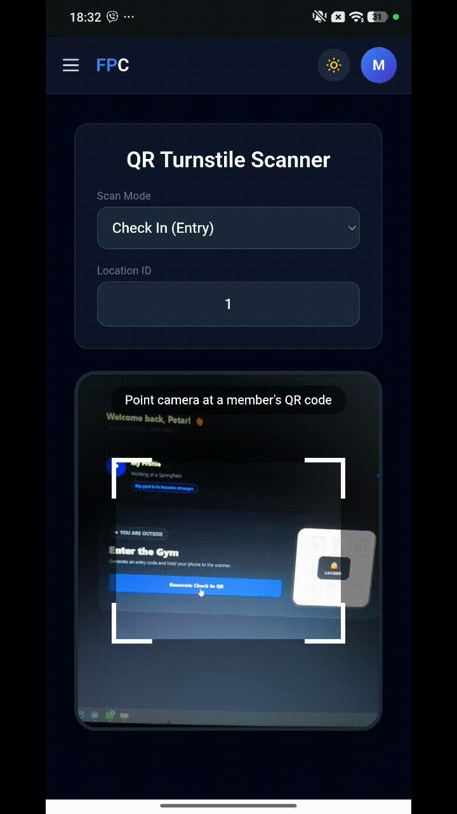
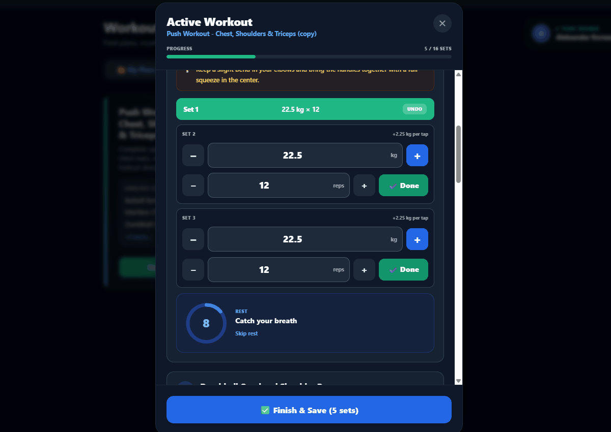
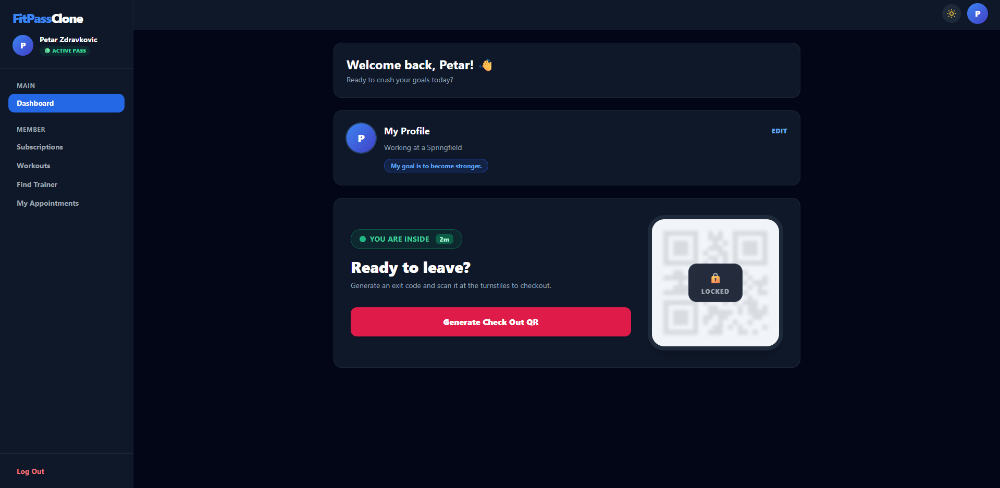
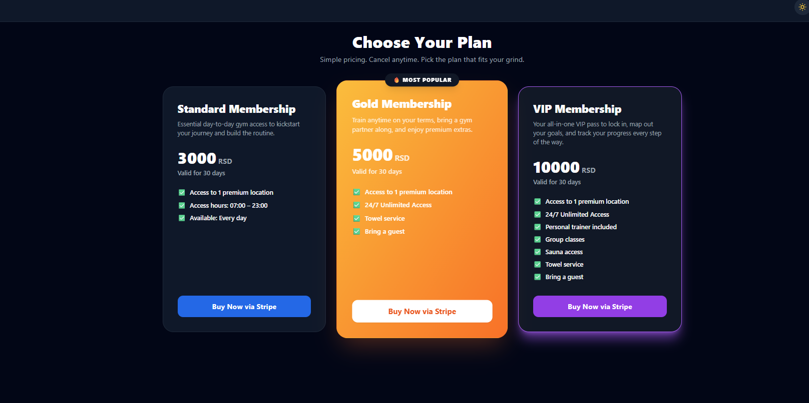
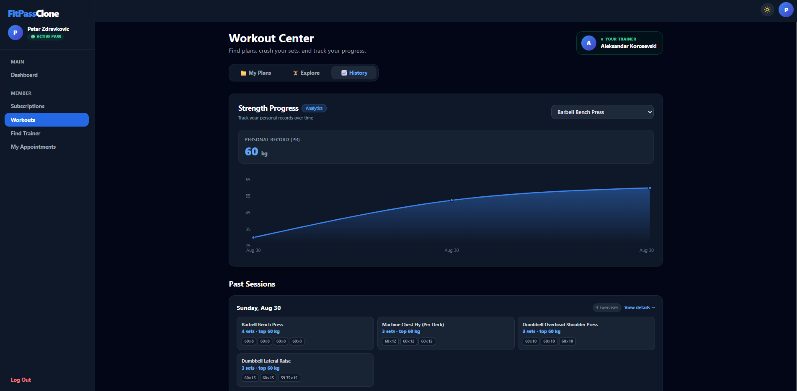
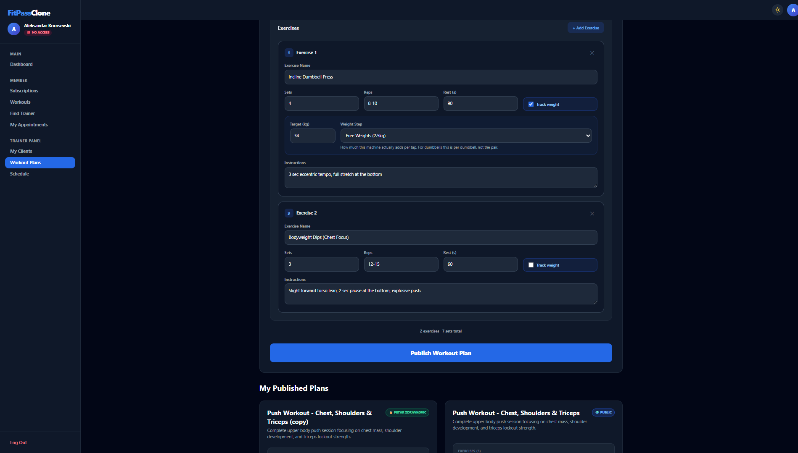
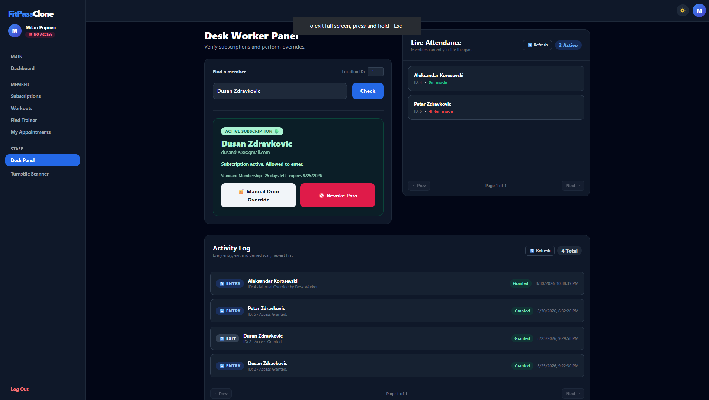
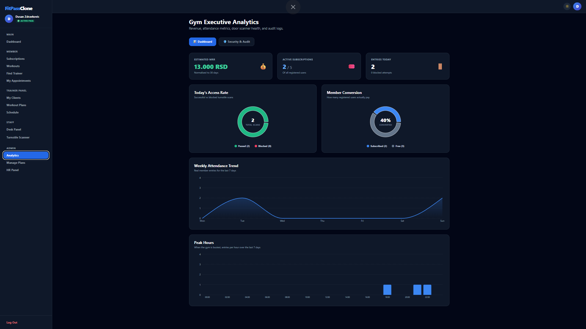

<div align="center">



**The role-driven web client for the FitPass gym platform.**

One React application that a member, a personal trainer, a front-desk worker and an
administrator all log into — and each of them sees a different product.

[](https://react.dev/)
[](https://www.typescriptlang.org/)
[](https://vite.dev/)
[](https://tailwindcss.com/)
[](https://tanstack.com/query/latest)
[](https://vitest.dev/)
[]()
[](./LICENSE)

</div>

---

## Table of Contents

- [Overview](#overview)
- [Gallery](#gallery)
- [Key Features](#key-features)
- [Technical Stack](#technical-stack)
- [Architecture at a Glance](#architecture-at-a-glance)
- [Getting Started](#getting-started)
- [Testing](#testing)
- [Production](#production)

---

## Overview

FitPass Clone is a gym management platform. This repository holds the **frontend only** — a
React 19 single-page application. The API it talks to is a FastAPI service living in its own
repository, and the two are deployed together.

Everything a gym does day to day is in here: selling memberships through Stripe, opening the
turnstile with a QR code that cannot be screenshotted and reused, staffing the front desk,
running the personal-training marketplace, and logging workouts set by set.

> **The frontend does not run standalone.** Authentication is an HTTP-Only cookie issued by
> the API; there is no token in JavaScript to fake and no mock layer to fall back on. Start
> the backend first — see [Getting Started](#getting-started).

---

## Gallery

<div align="center">

### The QR turnstile, revoked live

A member generates an entry code. The moment the scanner consumes it, the backend pushes a
WebSocket event and the QR disappears off the screen — a screenshot of a used code is worth
nothing.



### The scanner side of the door



### Logging a workout, set by set



### Light and dark


</div>

### The screens

| Member Dashboard | Subscriptions |
|:---:|:---:|
|  |  |

| Workout Progress | Trainer Plan Editor |
|:---:|:---:|
|  |  |

| Front Desk Panel | Admin Analytics |
|:---:|:---:|
|  |  |

---

## Key Features

### Cryptographic QR turnstile, with live revocation

A member generates an **intent-bound** QR code — `ENTRY` or `EXIT`, never a generic pass —
with a 5-minute TTL. The token is persisted to `localStorage`, so a page refresh does not
strand a member standing at the door. Rate-limit responses are parsed out of the API's
`Retry-After` header and rendered as a visible cooldown instead of a dead button.

The token is single-use server-side regardless. Wiping it from the screen closes the *social*
attack: a member cannot photograph a still-valid code and pass the picture to a friend outside.
It also gives the member unambiguous feedback that the scan worked, which matters at a turnstile
where nothing else confirms it.

That socket is not a naive `new WebSocket()`. `src/hooks/useGymWebSocket.ts` is a self-healing
connection with exponential backoff and jitter, built around the case that actually happens: a
member walks in, their phone hands off from mobile data to the gym WiFi, and a plain socket
dies silently while the page still looks healthy. It also refuses to retry a `1008` close,
because an expired cookie is not a network blip and retrying it just hammers the API on behalf
of someone who is logged out.

### The scanner side of the door

`/worker/scanner` turns any phone into a turnstile. It reads the member's code through the
device camera (`html5-qrcode`), submits it, and renders the verdict — including *why* a member
was refused, since the door policy checks location, weekday and opening hours, not just
whether the subscription is paid.

> The camera is the reason the dev server runs on **HTTPS**. Browsers refuse `getUserMedia` on
> an insecure origin, so a plain `http://localhost:5173` would leave this page permanently
> broken.

### Workout logging that survives the gym floor

Workouts are logged **one row per set**, not one per exercise, which is what makes automatic
personal-record detection possible. The live session modal keeps a rest timer running, beeps
through the Web Audio API (no asset to load) and vibrates on supported phones, so it stays
usable with the phone face-down on a bench between sets.

Progress is charted with Recharts — the max weight per exercise across a session, tracked over
time.

### Four roles, four products

| Role | What they get |
|---|---|
| **Member** | Subscribe through Stripe Checkout and manage the card through the Billing Portal, generate turnstile QR codes, request 1-on-1 coaching, book sessions, log workouts and track strength progress. |
| **Trainer** | Author public or private workout plans with per-exercise sets, reps, rest and weight-tracking rules; accept or decline client requests; run a daily appointment schedule. |
| **Worker** | A front-desk panel with live facility occupancy, member lookup with subscription standing, and audited manual door overrides for when a phone is dead. |
| **Admin** | An HR panel that hires and fires staff by assigning roles, plus system-wide analytics — MRR, peak hours, weekly attendance — and an audit trail of every manual override. |

Every role-gated route sits behind `<RequireRole>`, so a member who types `/admin/analytics`
gets a proper 403 page instead of a screen full of failed API calls.

### Security posture

- **HTTP-Only, `SameSite=Lax` JWT cookie.** No token in JavaScript, no `Authorization` header,
  nothing in `localStorage` that an injected script could read. A single Axios response
  interceptor turns any `401` into a redirect to `/login?session=expired`, so an expired
  session explains itself instead of dumping the user on a blank form.
- **Invisible honeypot fields and reCAPTCHA v3** on registration and login, behind a
  build-time feature flag.
- **A password strength meter that is a ladder, not a checklist.** Length is the floor;
  character variety only lifts a password that is already long enough — so `Ab1!de` scores low
  despite containing all four character classes.

---

## Technical Stack

| Layer | Technology |
|---|---|
| **Framework** | React 19, TypeScript, Vite 8 |
| **Routing** | React Router DOM v7 |
| **Server state** | TanStack React Query v5 — every read is a `useQuery`, every write a `useMutation` |
| **HTTP** | Axios — one shared instance with `withCredentials` and a global 401 interceptor |
| **Realtime** | Native WebSocket, wrapped in a self-healing custom hook |
| **Styling** | Tailwind CSS 3.4, class-based dark mode persisted to `localStorage` |
| **Charts** | Recharts |
| **QR** | `qrcode.react` to render, `html5-qrcode` to scan |
| **Bot protection** | `react-google-recaptcha` (v3, build-time flag) |
| **Testing** | Vitest + React Testing Library, jsdom environment |
| **Production** | Multi-stage Docker build → Nginx (static serving, SPA fallback, `/api` reverse proxy) |

---

## Architecture at a Glance

Three decisions shape everything else in this codebase:

1. **The session is a cookie the JavaScript cannot see.** That rules out an entire family of
   patterns — no auth context holding a token, no manual header plumbing, no refresh dance. It
   also means `withCredentials: true` on the shared Axios instance is load-bearing.
2. **Server state belongs to React Query, component state to React.** There is no Redux and no
   global store, because almost nothing in this app is truly client state. `["userProfile"]` is
   the one cache key everything else hangs off; role changes, profile edits and subscription
   purchases all invalidate it.
3. **`src/App.tsx` is the single source of truth for routing and roles.** Route guards and
   sidebar links are kept in lockstep by hand, and each role section ends with its own 404 so a
   typo keeps the navigation instead of ejecting the user.

**→ Route map, sequence diagrams for the auth and turnstile flows, the cache-key reference and
the data-layer conventions: [`ARCHITECTURE.md`](./ARCHITECTURE.md)**

---

## Getting Started

### 1. Prerequisites

- **Node.js 20.19+ or 22.12+.** Vite 8 declares this in `engines`; Node 18 fails outright.
- A running instance of the **FitPass backend** (FastAPI + PostgreSQL + Redis) from its own
  repository.

### 2. Start the stack, in this order

Nothing in the frontend works until the API answers, so the API goes first.

```bash
# 1. Infrastructure — in the BACKEND repository
docker-compose up -d                 # PostgreSQL on :5433, Redis on :6379

# 2. The API — in the BACKEND repository
uvicorn app.main:app --reload        # http://127.0.0.1:8000

# 3. This application
npm install
npm run dev                          # https://localhost:5173
```

### 3. Environment variables

Create a `.env` file in the root of this repository:

```env
# Relative on purpose. Do not change this to an absolute URL.
VITE_API_BASE_URL=/api

# Bot protection. Leave false unless you have a real site key.
VITE_FEATURE_RECAPTCHA=false
VITE_RECAPTCHA_SITE_KEY=
```

Three things about that file are worth understanding before editing it:

- **`VITE_API_BASE_URL` is a relative path, not a URL.** `vite.config.ts` proxies `/api`
  (WebSocket upgrades included) through to `http://127.0.0.1:8000`. Because the browser then
  only ever talks to its own origin, CORS never comes up and the `SameSite=Lax` cookie is sent
  normally. Pointing this at `http://localhost:8000/api` instead reintroduces both problems and
  breaks the login cookie. In production the same relative path is served by Nginx, which is
  why the API host never has to be known at build time.
- **The dev server is HTTPS**, via `@vitejs/plugin-basic-ssl`. Your browser will warn about the
  self-signed certificate — that is expected; accept it once. HTTPS is not optional here: the
  scanner page needs camera access, and browsers only grant it on a secure origin.
- **`VITE_*` values are inlined at build time**, not read at runtime. Vite performs a literal
  find-and-replace during `vite build`, so setting one of these in a container's `environment:`
  block does nothing at all — the bundle was finalised long before the container started. They
  have to arrive as Docker build args instead.

`server.host: true` is also set, so the dev server is reachable from a phone on the same LAN —
which is how the turnstile scanner gets tested with a real camera.

### 4. Available scripts

```bash
npm run dev          # Vite dev server, HTTPS, with the /api proxy
npm run build        # tsc -b && vite build  →  dist/
npm run preview      # serve the production build locally
npm run lint         # eslint
npm test             # vitest run
npm run test:watch   # vitest in watch mode
```

---

## Testing

**86 tests across 7 files**, run with Vitest and React Testing Library in a jsdom environment.
Tests sit next to the code they cover as `*.test.ts(x)` under `src/`, which means `tsc -b`
type-checks them and `npm run build` fails on a broken one.

```bash
npm test
```

Four conventions hold the suite together, each of them paid for once:

- **No Vitest globals.** `describe`, `it`, `expect` and `vi` are imported from `"vitest"`. That
  is also why `src/setupTests.ts` calls RTL's `cleanup()` by hand — RTL only registers its own
  cleanup automatically when `afterEach` happens to be a global, and here it is not.
- **Feature flags are pinned in `vite.config.ts`.** The test block sets
  `VITE_FEATURE_RECAPTCHA: 'false'`. Flags are read at module import time and `.env` is
  git-ignored, so without the pin the suite would be green or red depending on whose machine it
  ran on — and a true flag would make the login test call Google.
- **Do not mock what you are testing.** `RequireRole.test.tsx` builds the real
  `MemoryRouter` → `<Outlet context={user}>` → guard → page tree rather than mocking
  `useOutletContext`. That is the only reason it catches a dropped `context` prop.
- **The API is mocked at `vi.spyOn(api, "post")`,** never with a real request. The spy replaces
  the method ahead of the interceptors, so the global 401 redirect cannot fire inside jsdom.

Regression tests are verified by reverting the fix they cover and confirming the test actually
fails — a test written after the fix passes for free otherwise.

---

## Production

The application ships as a **multi-stage Docker build** (`Dockerfile.prod`): Node compiles the
bundle, then a fresh `nginx:alpine` image copies in nothing but `dist/`. No Node runtime, no
`node_modules` and no source code reaches production — roughly 50 MB instead of 1 GB.

Nginx (`nginx.conf`) then does two jobs at once: it serves the static SPA with a `try_files`
fallback so deep links and refreshes survive, and it reverse-proxies `/api` to the backend
container. Same origin for the page and the API means CORS never comes up in production either,
and the auth cookie behaves exactly as it does in development. The WebSocket location is
declared separately, ahead of `/api/`, so the `Upgrade` handshake is passed through rather than
silently degraded to a normal request.

`VITE_*` values must be supplied as **Docker build args**, not environment variables — see the
note in [Getting Started](#3-environment-variables) for why.

---

<div align="center">

Built with React, TypeScript and Tailwind CSS.

</div>
